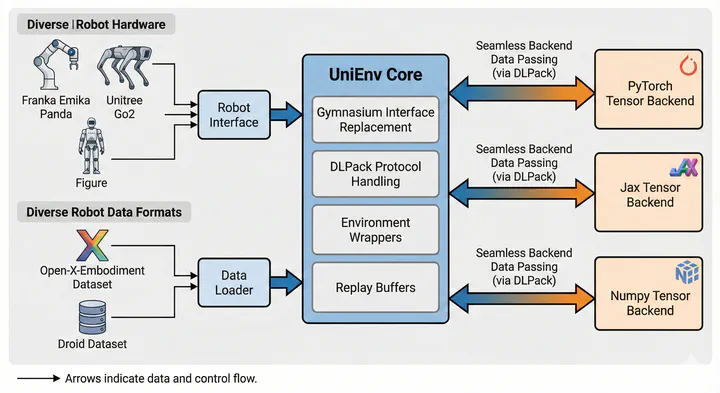

# UniEnv

UniEnv is a robotics-oriented interface layer for environments, worlds, data pipelines, and backend-aware transformations.

It is built to let the same codebase span:

- simulation environments and real-world control loops
- stateful and functional environment styles
- structured observations and flattened tensor views
- online interaction and offline dataset workflows
- multiple array backends through a shared compute abstraction

## Why UniEnv

UniEnv gives you one vocabulary for the parts that tend to fragment robotics codebases:

- **Environment APIs** for `reset`, `step`, `render`, and typed spaces
- **World composition** for building environments from reusable nodes
- **Wrappers and transformations** for action scaling, flattening, frame stacking, backend conversion, and recording
- **Data interfaces** for replay buffers, storage backends, and dataset adapters

The result is a package that can sit between your simulator, robot stack, dataset format, and learning code without forcing each layer to invent its own data model.

## Start Here

-   :material-rocket-launch-outline: **Getting Started**

    ---

    Install UniEnv, learn the package layout, and see the smallest useful workflow.

    [Open the guide](getting-started.md)

-   :material-shape-outline: **Core Concepts**

    ---

    Learn how environments, spaces, backends, worlds, and nodes fit together.

    [Browse the concepts](concepts/index.md)

-   :material-book-open-page-variant-outline: **Guides**

    ---

    Go straight to wrappers, replay buffers, storages, and dataset integrations.

    [Browse the guides](guides/index.md)

-   :material-code-braces: **API Reference**

    ---

    Inspect the generated module reference for `unienv_interface` and `unienv_data`.

    [Open the API reference](api/index.md)

## Package Map

| Area | What it covers | Key modules |
| --- | --- | --- |
| Interface layer | Spaces, environments, wrappers, transformations | `unienv_interface.space`, `unienv_interface.env_base`, `unienv_interface.wrapper`, `unienv_interface.transformations` |
| Composition layer | Worlds, nodes, and environment composition | `unienv_interface.world` |
| Data layer | Batches, replay buffers, storage, samplers | `unienv_data.base`, `unienv_data.replay_buffer`, `unienv_data.storages`, `unienv_data.samplers` |
| Integrations | External dataset and training ecosystem adapters | `unienv_data.integrations` |

## Reading Order

If you are new to the project, a good path is:

1. Read [Getting Started](getting-started.md).
2. Read [Environments](concepts/environments.md) and [Spaces and Backends](concepts/spaces-and-backends.md).
3. Read [World Composition](concepts/world-composition.md) if you are composing complex simulators or robot systems.
4. Read [Wrappers and Transformations](guides/wrappers-and-transformations.md) and [Replay Buffers and Storage](guides/replay-buffers-and-storage.md) for day-to-day usage.
